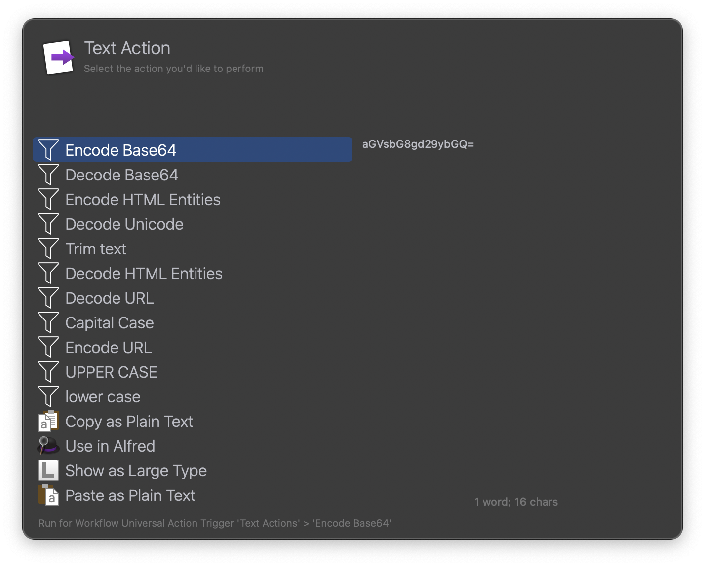

Text Actions
============

Alfred workflow with different text transformations actions:
- Decode/Encode Base64
- Decode/Encode HTML Entities
- Decode/Encode URL
- Decode Unicode
- Capital Case
- lower case
- UPPER CASE
- Trim text

